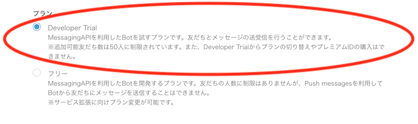

### ハンズオン資料

+ ぼっとちゃんを作成する為の手順
    + 個人用のボット作成手順です

---

### Botアプリケーション構造のイメージ

---

### 手順

1. LINE DevelopersでChannelの作成
2. Microsoft AzureでFace APIの作成
3. Microsoft AzureでFunctionの作成
4. 動作確認

---

### 1. LINE DevelopersでChannelの作成

---

### LINE Developersにログイン

Time: 3m

1. [LINE developers](https://developers.line.biz/ja/)から、ログインページに移動
2. `LINEでログイン`を選択
    * LINE Business ID
        * 今回は個人用の為、私用のLINEアカウントで行います

---

### プロバイダーの作成

Time: 3m

+ プロバイダー
    + サービス提供者（企業・個人）の名前です

1. `新規プロバイダーの作成`を選択
2. `プロバイダー名`の入力し`確認する`を選択

3. 確認画面で名前の変更がなければ`作成`を選択

---

### チャンネルの作成

1. 作成したプロバイダーを選択後、`新規チャンネル作成`を選択
2. チャンネルを選択
    + 今回は、Azureを使用しBotを作成する為、`Messaging API`を選択

3. Messaging APIの情報を入力
    + アプリアイコン画像を指定
        + 3MB以内, JPEG/PNG/GIF/BMP形式
    + アプリ名を指定
        + 20文字以内
        + 名前は7日間は変更できないので注意
    + アプリ説明
        + 500文字以内
    + 料金プランの選択
        + 初期選択プラン(Developer Trial or フリー)はどちらも無料で利用できます。どちらでも今回は可能ですが、個人用なので`Developer Trial`を選択する
        
    + 大業種と小業種を指定
        + 今回は個人用なので、大業種は`個人`を選択
    + メールアドレスを指定
        + 重要なお知らせと、最新ニュースが届きます
4. 内容の入力が完了後、`入力内容を確認する`を選択
5. 確認画面で変更がなければ`作成`を選択
---

### 4枚目のスライド
