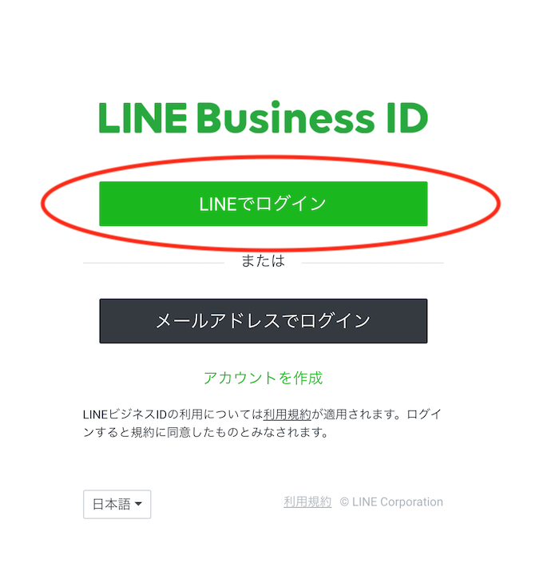
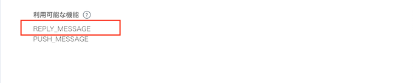
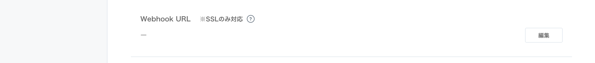

# ハンズオン資料

ぼっとちゃんを作成する為の手順

個人用のボット作成手順です

+ レベル
    + Gitの基本的な操作
+ 必要なもの
    + LINEアカウント
    + LINEのアプリケーション
    + Azure アカウント(お金がかかっても大丈夫なアカウント)

## Botアプリケーション構造のイメージ


---

## 手順

1. LINE Developersでチャネルの作成 (30分)
2. Microsoft Azureでリソースグループの作成(5分)
3. Microsoft AzureでFace APIの作成(5分)
4. Microsoft AzureでFunctionの作成(5分)
5. HTTP trigger作成(10分)
6. Queue trigger作成(15分)
7. LINE DevelopersのチャネルからAzure FunctionにKickする(10分)

---

## LINE Developersでチャネルの作成(30分)

チャネルの作成を行う。

1. LINE Developersにログイン
2. プロバイダーの作成
3. チャネルの作成
4. チャネルの設定
5. チャネルの完成

---

### LINE Developersにログイン

Time: 5m

1. [LINE developers](https://developers.line.biz/ja/)から、ログインページに移動
2. `LINEでログイン`を選択
    * LINE Business ID
        * 今回は個人用の為、私用のLINEアカウントで行います


---

### プロバイダーの作成

Time: 5m

+ プロバイダー
    + サービス提供者（企業・個人）の名前です

1. `新規プロバイダーの作成`を選択
2. `プロバイダー名`の入力し`確認する`を選択

3. 確認画面で名前の変更がなければ`作成`を選択

---

### チャネルの作成

Time: 10m

1. 作成したプロバイダーを選択後、`新規チャネル作成`を選択
2. チャネルを選択
    + 今回は、Azureを使用しBotを作成する為、`Messaging API`を選択

3. Messaging APIの情報を入力
    + アプリアイコン画像を指定
        + 3MB以内, JPEG/PNG/GIF/BMP形式
    + アプリ名を指定
        + 20文字以内
        + 名前は7日間は変更できないので注意
    + アプリ説明
        + 500文字以内
    + 料金プランの選択
        + 初期選択プラン(Developer Trial or フリー)はどちらも無料で利用可能。どちらでも今回は可能ですが、個人用なので`Developer Trial`を選択する
        
    + 大業種と小業種を指定
        + 今回は個人用なので、大業種は`個人`を選択
    + メールアドレスを指定
        + 重要なお知らせと、最新ニュースが届きます
4. 内容の入力が完了後、`入力内容を確認する`を選択
5. 確認画面で変更がなければ`作成`を選択

---

### チャネルの設定

Time: 10m

チャネルの設定を行う

1. 作成したチャネルに移動する
2. `チャネル基本設定`に移動する

3. `Channel Secret`(秘密鍵)を、後ほど使用するので、メモしておく

4. `アクセストークン`を発行し、後ほど使用するので、メモしておく
5. `Webhook送信`を`利用する`に指定する
6. `Webhook URL`は、後ほど、Azure Function作成後、指定する

7. `利用可能な機能`に`REPLY_MESSAGE`を追加する

8. `自動応答メッセージ`を`利用しない`に指定する


---

### チャネルの完成

ここまででLINE Developersでチャネルの作成は、終了です


---

## Microsoft Azureでリソースグループの作成(5分)

サービス作成する時に、リソースグループも一緒に作成できますが、
今回は先に`空のリソースグループ`を作成します。

1. [Azure portal](https://portal.azure.com/)で、ログインする
2. 左上の`リソースの作成`を選択
3. 検索欄に`リソースグループ`を入力し検索する
4. 検索条件で表示された`リソースグループ`を選択

5. 作成を選択
6. リソースグループを作成する
    + リソースグループ名
    + サブスクリプション
        + 使用するサブスクリプション
        を選択
    + リソースの場所
        + 東日本(適切なデータセンターを指定)

7. 作成を選択
8. [リソースグループ ○○○ が正常に作成されました] という通知が表示されればOK

## Microsoft AzureでFace APIの作成(5分)

顔年齢を算出してくれるMicrosoftの`CognitiveServices`の１つである、`Face API`を利用します。

1. [Azure portal](https://portal.azure.com/)で、ログインする
2. 左上の`リソースの作成`を選択
3. 検索欄に`Face`を入力し検索する
4. 検索条件で表示された`Face`を選択

5. 作成を選択
6. cognitive services Face APIを作成する
    + Name
    + サブスクリプション
        + 使用するサブスクリプション
        を選択
    + 場所
        + 東日本(適切なデータセンターを指定)
    + 価格レベル
        + 無料枠の`F0`を選択
    + Resource group
        + 先ほど作成したリソースグループを選択

6. 作成を選択
7. [リソースグループ ○○○ への'Microsoft.CognitiveServicesFace' のデプロイが成功しました。] という通知が表示されればOK
8. 作成したFaceAPIに移動する
9. 左のメニューバーにある`Keys`を選択する
10. KEYをメモしておく


## Microsoft AzureでFunctionの作成(5分)

1. [Azure portal](https://portal.azure.com/)で、ログインする
2. 左上の`リソースの作成`を選択
3. 検索欄に`Function App`を入力し検索する
4. 検索条件で表示された`Function App`を選択

5. 作成を選択
6. cognitive services Face APIを作成する
    + アプリ名
    + サブスクリプション
        + 使用するサブスクリプション
        を選択
    + リソースグループ
        + 先ほど作成したリソースグループを選択
    + OS
        + Windows
    + ホスティング プラン
        + 従量課金プラン
    + 場所
        + 東日本(適切なデータセンターを指定)
    + ランタイムストック
        + JavaScript
    + Storage
        + 新規作成(※作成してる場合は既存のものを使用してください)
    + Application Insights
        + オン
    + Application Insightsの場所
        + Southeast Asia(適切なデータセンターを指定)


6. 作成を選択
7. [リソースグループ ○○○ への'Microsoft.FunctionApp' のデプロイが成功しました。] という通知が表示されればOK

## HTTP trigger作成(10分)

1. 先ほど作成したFunction Appを選択する
2. `関数`の横に`+`を選択し、関数の作成を行う
3. `HTTP trigger`を選択する
4. HTTP triggerを作成する
    + 言語
        + javaScript
    + 名前
        + HttpTriggerJS1
    + 承認レベル
        + Function

5. 作成した`HttpTriggerJS1`を選択する
6. 開発タブを選択し、以下のコードに置き換える

+ function.json
Azure Queue Storageへのバインド設定を追加する

```json
{
  "bindings": [
    {
      "authLevel": "function",
      "type": "httpTrigger",
      "direction": "in",
      "name": "req"
    },
    {
      "type": "http",
      "direction": "out",
      "name": "$return"
    },
    {
      "type": "queue",
      "name": "outputQueueItem",
      "queueName": "js-queue-items",
      "connection": "AzureWebJobsDashboard",
      "direction": "out"
    }
  ],
  "disabled": false
}
```

+ index.js
LINEからHTTP送信されたBodyをAzure Queue Storageに設定する処理

```js
module.exports = function (context, req) {
  context.bindings.outputQueueItem = req.body;
  res = { body : "" };
  context.done();
};
```

7. 上の方にある`関数のURLの取得`を選択する
8. 表示されたURLをメモしておく


## Queue trigger作成(15分)

1. 先ほど作成したFunction Appを選択する
2. `関数`の横に`+`を選択し、関数の作成を行う
3. `Queue trigger`を選択する
4. Queue triggerを作成する
    + 言語
        + javaScript
    + 名前
        + QueueTriggerJS1
    + 承認レベル
        + Function
    + Azure Queue Storage trigger(キュー名)
        + 作成したHttpTriggerJS1の`function.json`の`queueName`に合わせる
    + Azure Queue Storage trigger(ストレージ アカウント接続)
        + 作成したHttpTriggerJS1の`function.json`の`connection`に合わせる

5. 作成した`QueueTriggerJS1`を選択する
6. 開発タブに移動し、以下のコードに置き換える

+ function.json

```
{
  "bindings": [
    {
      "name": "myQueueItem",
      "type": "queueTrigger",
      "direction": "in",
      "queueName": "js-queue-items",
      "connection": "AzureWebJobsDashboard"
    }
  ],
  "disabled": false
}
```

+ index.js
Azure Queue Storageに設定された内容を取得し、画像ならFaceAPIに渡し、年齢をLINEに送信する

```js
const https = require('https');
const url = require('url');

const FACE_API = 'https://australiaeast.api.cognitive.microsoft.com/face/v1.0/detect?returnFaceId=true&returnFaceLandmarks=false&returnFaceAttributes=age,gender,smile';

/**
 * JavaScript queue trigger function processed work item
 * @param {*} context
 * @param {*} myQueueItem
 */
module.exports = function(context, myQueueItem) {
  myQueueItem.events.forEach((event) => postMessage(context, event));
  context.done();
};

/**
 * Determining the message type
 * @param {*} context
 * @param {*} event
 */
function postMessage(context, event) {
  var messageType = event.message.type;
  if (messageType === 'text') {
    postLineMessage(context, event, '画像をおくってください');
    // postCognitiveUrl(context, event);
  } else if (messageType === 'image') {
    getImageData(context, event)
    .then((postData) =>{
        postCognitiveImage(context, event, postData);
    })
    .catch((err) => {
      context.log(err);
      postCognitiveImage(context, event, err);
    });
  } else if (messageType === 'sticker') {
    postLineMessage(context, event, '画像をおくってください');
  } else {
    postLineMessage(context, event, '画像をおくってください');
  }
}

/**
 *  Send image data to Face API
 * @param {*} context
 * @param {*} event
 * @param {*} postData
 */
function postCognitiveImage(context, event, postData) {
  var parseUrl = url.parse(FACE_API);
  var postOptions = {
      host: parseUrl.host,
      path: parseUrl.path,
      method: 'POST',
      headers: {
          'Content-Type': 'application/octet-stream',
          'Content-Length': postData.length,
          'Ocp-Apim-Subscription-Key': process.env.COGNITIVE_KEY,
      },
  };

  var bodyString = null;

  var req = https.request(postOptions, function(res) {
     context.log('STATUS: ' + res.statusCode);
    res.setEncoding('utf8');
    res.on('data', function(chunk) {
      bodyString = chunk;
    }).on('end', function() {
      if (res.statusCode !== 200 || bodyString === '[]') {
        postLineMessage(context, event, '顔が認識できませんでした');
      } else {
        var result = JSON.parse(bodyString);
        var age = result[0].faceAttributes.age;
        postLineMessage(context, event, age + '歳');
      }
    });
  });
  req.write(postData);
  req.end();
}

/**
 * Send message to LINE
 * @param {*} context
 * @param {*} event
 * @param {*} msg
 */
function postLineMessage(context, event, msg) {
  var jObj = {};
  jObj.type = 'text';
  jObj.id = event.message.id;
  jObj.text = msg;

  var postData = JSON.stringify({
    'replyToken': event.replyToken,
    'messages': [jObj],
  });

  var parseUrl = url.parse('https://api.line.me/v2/bot/message/reply');
  var postOptions = {
    host: parseUrl.host,
    path: parseUrl.path,
    method: 'POST',
    headers: {
      'Content-Type': 'application/json',
      'Authorization': 'Bearer {' + process.env.LINE_CHANNEL_ACCESS_TOKEN + '}',
      'Content-Length': Buffer.byteLength(postData),
    },
  };

  var req = https.request(postOptions);
  req.write(postData);
  req.end();
}

/**
 * Retrieve image data from LINE
 * @param {*} context
 * @param {*} event
 */
function getImageData(context, event) {
    return new Promise((resolve, reject) => {
        var messageId = event.message.id;
        var parseUrl = url.parse('https://api.line.me/v2/bot/message/' + messageId + '/content');
        var postOptions = {
        host: parseUrl.host,
        path: parseUrl.path,
        method: 'GET',
            headers: {
                'Content-type': 'application/json',
                'Authorization': 'Bearer {' + process.env.LINE_CHANNEL_ACCESS_TOKEN + '}',
            },
        };
        var req = https.request(postOptions, function(res) {
            var data = [];
            res.on('data', function(chunk) {
                data.push(new Buffer(chunk));
            }).on('error', function(err) {
                context.log(err);
                postLineMessage(context, event, err);
                reject(err);
            }).on('end', function() {
                var postData = Buffer.concat(data);
                resolve(postData);
            });
            });
        req.end();
    });
}
```


## LINE DevelopersのチャネルからAzure FunctionにKickする(10分)

1. 作成したFunctionAppの`アプリケーション設定`に移動する

2. アプリケーション設定に以下を追加する

| アプリ設定名 | 値 |
| --- | --- |
| COGNITIVE_KEY | FaceAPI作成時、メモしたKEY |
| LINE_CHANNEL_ACCESS_TOKEN | チャネル作成時、メモしたアクセストークン |
| LINE_CHANNEL_SECRET | チャネル作成時、メモしたシークレットキー |

3. チャネルの`Webhook URL`に、HTTP triggerの`関数のURLの取得`で取得したURLを指定する



