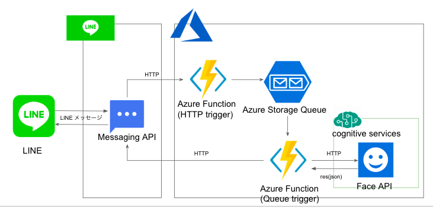
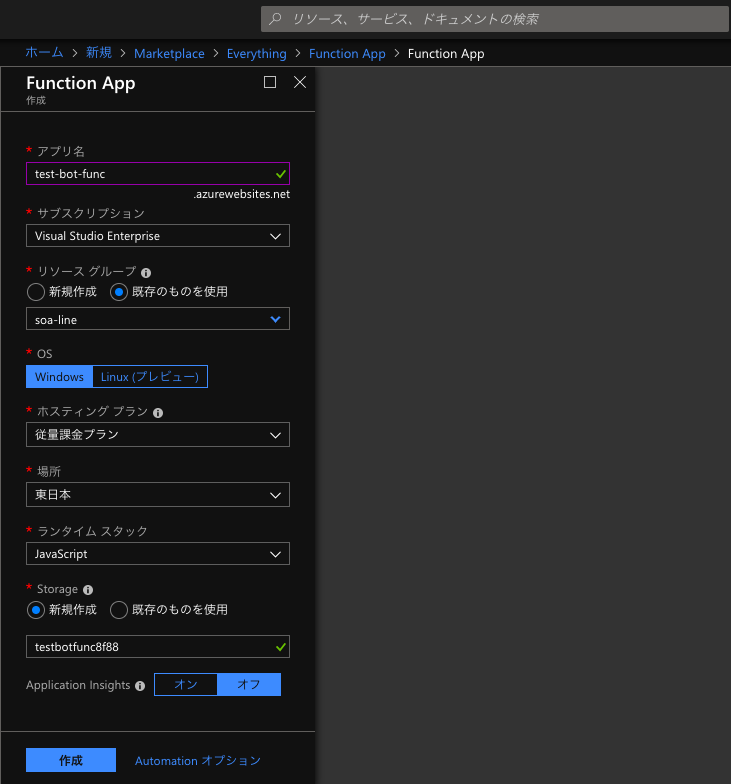

# 顔年齢判断BOTを作成する為の手順

個人用のボット作成手順です。
ハンズオン用作成している為、事前準備などが記載されております。

+ 事前準備
    + 主催者が準備、セットアップしておくもの
        + PC
            + 本ハンズオンではAzure上での作業にしたので、指定はございません
        + エディタ
            + メモ程度なので特に指定はございません
        + LINE アプリケーション
            + スマホ/PC　どちらでも可
        + LINEアカウント
        + Azure アカウント
+ レベル/事前予習
    + HTTPを触ったことがある
    + サーバレスアーキテクチャを触ったことがある
    + Azureサービスを触ったことがある
    + Linuxターミナルを触ったことがある

## Botアプリケーション構造のイメージ



---

## 手順

1. LINE Developersでチャネルの作成 (30分)
2. Microsoft Azureでリソースグループの作成(5分)
3. Microsoft AzureでFace APIの作成(5分)
4. Microsoft AzureでFunctionの作成(5分)
5. HTTP trigger作成(10分)
6. Queue trigger作成(15分)
7. アプリケーション設定で環境変数を指定(5分)
8. LINE DevelopersのチャネルからAzure FunctionにKickする(5分)
9. 顔が映った画像を送信してみる(5分)

---

## 準備

+ メモを途中で行うので、Visual Studio Code等のエディターを事前に開いておいてく

---

## LINE Developersでチャネルの作成(30分)

チャネルの作成を行う。

1. LINE Developersにログイン
2. プロバイダーの作成
3. チャネルの作成
4. チャネルの設定
5. チャネルの完成

---

### LINE Developersにログイン

Time: 5m

1. [LINE developers](https://developers.line.biz/ja/)から、ログインページに移動
2. `LINEでログイン`を選択
    * LINE Business ID
        * 今回は個人用の為、私用のLINEアカウントで行います


---

### プロバイダーの作成

Time: 5m

+ プロバイダー
    + サービス提供者（企業・個人）の名前です

1. `新規プロバイダーの作成`を選択
2. `プロバイダー名`に`個人名`を入力し`確認する`を選択

3. 確認画面で名前の変更がなければ`作成`を選択

---

### チャネルの作成

Time: 10m

1. 作成したプロバイダーを選択後、`新規チャネル作成`を選択
2. チャネルを選択
    + 今回は、Azureを使用しBotを作成する為、`Messaging API`を選択

3. Messaging APIの情報を入力
    + アプリアイコン画像を指定
        + 3MB以内, JPEG/PNG/GIF/BMP形式
    + アプリ名
        + `顔年齢判断BOT`と指定する(別名でも可)
        + 20文字以内
        + 名前は7日間は変更できないので注意
    + アプリ説明
        + `顔年齢を判断してくれるBOTです`と記載する
        + 500文字以内
    + 料金プランの選択
        + 初期選択プラン(Developer Trial or フリー)はどちらも無料で利用可能。どちらでも今回は可能ですが、個人用なので`Developer Trial`を選択する
        
    + 大業種と小業種を指定
        + 今回は個人用なので、大業種は`個人`を選択
    + メールアドレスを指定
        + 重要なお知らせと、最新ニュースが届きます
4. 内容の入力が完了後、`入力内容を確認する`を選択
5. 確認画面で変更がなければ`作成`を選択

---

### チャネルの設定

Time: 10m

チャネルの設定を行う

1. 作成したチャネルに移動する
2. `チャネル基本設定`に移動する

3. `Channel Secret`(秘密鍵)を、後ほど使用するので、メモしておく(※他人に知られないlocal環境のエディタでメモしてください)

4. `アクセストークン`を発行し、後ほど使用するので、メモしておく(※他人に知られないlocal環境のエディタでメモしてください)
5. `Webhook送信`を`利用する`に指定する
6. `Webhook URL`は、後ほど、Azure Function作成後、指定する

7. `利用可能な機能`に`REPLY_MESSAGE`を追加する

8. `自動応答メッセージ`を`利用しない`に指定する


---

### チャネルの完成

ここまででLINE Developersでチャネルの作成は、終了です


---

## Microsoft Azureでリソースグループの作成(5分)

サービス作成する時に、リソースグループも一緒に作成できますが、
今回は先に`空のリソースグループ`を作成します。

1. [Azure portal](https://portal.azure.com/)で、ログインする
2. 左上の`リソースの作成`を選択
3. 検索欄に`リソースグループ`を入力し検索する
4. 検索条件で表示された`リソースグループ`を選択

5. 作成を選択
6. リソースグループを作成する
    + リソースグループ名
        + `test-bot-group`
    + サブスクリプション
        + 使用するサブスクリプション
        を選択
    + リソースの場所
        + `東南アジア`(適切なデータセンターを指定)

7. 作成を選択
8. [リソースグループ ○○○ が正常に作成されました] という通知が表示されればOK

## Microsoft AzureでFace APIの作成(5分)

顔年齢を算出してくれるMicrosoftの`CognitiveServices`の１つである、`Face API`を利用します。

1. [Azure portal](https://portal.azure.com/)で、ログインする
2. 左上の`リソースの作成`を選択
3. 検索欄に`Face`を入力し検索する
4. 検索条件で表示された`Face`を選択

5. 作成を選択
6. cognitive services Face APIを作成する
    + Name
        + `test-bot-face`
    + サブスクリプション
        + 使用するサブスクリプション
        を選択
    + 場所
        + `東南アジア`(適切なデータセンターを指定)
    + 価格レベル
        + 無料枠の`F0`を選択
    + Resource group
        + 先ほど作成したリソースグループを選択

6. 作成を選択
7. [リソースグループ ○○○ への'Microsoft.CognitiveServicesFace' のデプロイが成功しました。] という通知が表示されればOK
8. 作成したFaceAPIに移動する
9. 左のメニューバーにある`Keys`を選択する
10. KEYをメモしておく(※他人に知られないlocal環境のエディタでメモしてください)


## Microsoft AzureでFunctionの作成(5分)

1. [Azure portal](https://portal.azure.com/)で、ログインする
2. 左上の`リソースの作成`を選択
3. 検索欄に`Function App`を入力し検索する
4. 検索条件で表示された`Function App`を選択

5. 作成を選択
6. cognitive services Face APIを作成する
    + アプリ名
        + `test-bot`(ユニーク指定なので被らないように変更してください)
    + サブスクリプション
        + 使用するサブスクリプション
        を選択
    + リソースグループ
        + 先ほど作成したリソースグループを選択
    + OS
        + `Windows`を指定する
    + ホスティング プラン
        + `従量課金プラン`を指定する
        + 今回は、個人用で月100万回は超えない想定の為、主に価格で従量課金プランを選んだ
        + Functionのホスティングプランについて、最後にoptionで書いてありますので参考にしてください
    + 場所
        + `東南アジア`(適切なデータセンターを指定)を指定する
    + ランタイムストック
        + `JavaScript`を指定する
    + Storage
        + `新規作成`(※作成してる場合は既存のものを使用してください)を指定する
    + Application Insights
        + `オフ`を指定する
        + パフォーマンス管理 (APM) サービスであり、異常があると、自動的に検出し、それを組み込まれている分析ツールで問題診断ができる
        + パフォーマンスやユーザビリティを継続的に向上させるうえで役立つ為、使用した方が良いが、今回は試用な為、オフにする

6. 作成を選択
7. [リソースグループ ○○○ への'Microsoft.FunctionApp' のデプロイが成功しました。] という通知が表示されればOK

## HTTP trigger作成(10分)

1. 先ほど作成したFunction Appを選択する
2. `関数`の横に`+`を選択し、関数の作成を行う
3. `HTTP trigger`を選択する
4. HTTP triggerを作成する
    + 言語
        + `javaScript`
    + 名前
        + `HttpTriggerJS1`を指定する
    + 承認レベル
        + `Function`

5. 作成した`HttpTriggerJS1`を選択する
6. LINEから送られてきた内容を`Azure Queue Storage`に保存する為、バインド設定を追加


Azure Queue Storageを選択


`キュー名`、`ストレージアカウント接続名`をメモし、保存を選択


7. 開発タブを選択し、以下のコードに置き換える

+ index.js
    + LINEからHTTP送信されたBodyをAzure Queue Storageに設定する

```js
module.exports = function (context, req) {
  context.bindings.outputQueueItem = req.body;
  context.done();
};
```

8. 上の方にある`関数のURLの取得`を選択する
9. 表示されたURLをメモしておく(※他人に知られないlocal環境のエディタでメモしてください)


## Queue trigger作成(15分)

1. 先ほど作成したFunction Appを選択する
2. `関数`の横に`+`を選択し、関数の作成を行う
3. `Queue trigger`を選択する
4. Queue triggerを作成する
    + 言語
        + `javaScript`
    + 名前
        + `QueueTriggerJS1`
    + 承認レベル
        + `Function`
    + Azure Queue Storage trigger(キュー名)
        + 作成したHttpTriggerJS1の`function.json`の`queueName`と一致させる
    + Azure Queue Storage trigger(ストレージ アカウント接続)
        + 作成したHttpTriggerJS1の`function.json`の`connection`と一致させる

5. 作成した`QueueTriggerJS1`を選択する
6. 開発タブに移動し、以下のコードに置き換える

+ index.js
    + Azure Queue Storageに設定された内容を取得し、画像であるなら、LINEから画像データを取得する。画像データをFaceAPIに渡し、返ってきた年齢情報をLINEに送信する

```js
/* QueueTriggerJS1/index.js を参照してください */
```

[index](QueueTriggerJS1/index.js)


7. 外部パッケージ(LINE SDK)を使用する

index.jsでLINE SDKを使用している為、インストールする
作成したFunctionの`プラットフォーム機能` → `コンソール`を選択する


`QueueTriggerJS1`の下で以下を実行

```shell
$ npm install @line/bot-sdk --save
```

#### LINEから送られてくる内容の例

```
{
    type: 'message',
    replyToken: '00000000000000',
    source: {
        userId: '0000000000',
        type: 'user'
        },
    timestamp: 1543305211012,
    message: {
        type: 'image',
        id: '0000000000000',
        contentProvider: {
            type: 'line'
            }
        },
}
```

#### プログラムの仕様

+ `メッセージタイプ`を判別
+ 画像の場合
    + LINEの`画像取得API`を使い、`メッセージID`に紐づいている画像データを取得する
    + 画像データを`Face API`に送り、年齢の情報を取得
    + LINEの`リプライメッセージ送信API`に、リプライする`メッセージID`と`年齢を含めた表示させるメッセージ`を送る

## アプリケーション設定で環境変数を指定(5分)

1. 作成したFunctionAppの`アプリケーション設定`に移動する

2. アプリケーション設定に以下を追加する
    + これらは、BOTのプログラム中に、APIを特定する為使用されている

| アプリ設定名 | 値 | 使用用途 |
| --- | --- | --- |
| COGNITIVE_KEY | FaceAPI作成時、メモしたKEY | 作成したFace APIに画像データを送る際の識別に使われる |
| COGNITIVE_SERVICE_REGION | [overview](https://azure.microsoft.com/ja-jp/global-infrastructure/regions/)で調べる | Face APIの作成したリージョンを指定する(東南アジア:southeastasia) |
| LINE_CHANNEL_ACCESS_TOKEN | チャネル作成時、メモしたアクセストークン | 作成したLINEのチャネルを特定しCallする為に使われる |
| LINE_CHANNEL_SECRET | チャネル作成時、メモしたシークレットキー |  作成したLINEのチャネルを特定しCallする為に使われる |

## LINE DevelopersのチャネルからAzure FunctionにKickする(5分)

3. チャネルの`Webhook URL`に、HTTP triggerの`関数のURLの取得`で取得したURLを指定する


## 顔が映った画像を送信してみる(5分)

+ 年齢が返ってくれば成功
    + 以下は、フリー画像を使わせて頂いています


## option

### Functionのホスティングプランについて

#### 比較

+ 従量課金プラン
    + ホストのインスタンスは、受信イベントの数に基づいて動的に追加および削除される
    + スケーリングが自動的に行われ、関数の実行中にのみコンピューティング リソースに対して料金が発生される
    + 構成可能な期間が経過すると関数の実行はタイムアウト(default: 5分)
    + 価格
        + 実行時間
            + ¥0.001792/GB 秒(月間 400,000 GB 秒の無料提供)
        + 総実行回数
            + 100万実行回数あたり¥22.40(毎月、最初の 100 万回は無料で実行できる)
+ App Service プラン
    + FunctionにはFREE、SHAREDプランがない為、安価で試すことができない
    + 専用 VM が関数アプリに割り当てられるので、関数を継続的に実行できる
    + CPU またはメモリのオプションが従量課金プランよりも多い
    + 許可されている最大実行時間 (10 分) より長く実行できる
    + プランと価格
        + S1
            + ACU 合計 100
            + 1.75 GB メモリ
            + A シリーズ計算と同等
            + 4999.68 JPY/月 (推定)
        + P1V2
            + ACU 合計 210
            + 3.5 GB メモリ
            + Dv2 シリーズ計算と同等
            + 16665.60 JPY/月 (推定)
        + P2V2
            + ACU 合計 420
            + 7 GB メモリ
            + Dv2 シリーズ計算と同等
            + 33331.20 JPY/月 (推定)
        + P3V2
            + ACU 合計 840
            + 14 GB メモリ
            + Dv2 シリーズ計算と同等
            + 66662.40 JPY/月 (推定)

#### 選び方

基本的には、従量課金でよいと思います。
既に他のApp Serviceインスタンスを実行している場合や、従量課金ではスペック(CPU、メモリ、実行時間など)が足りない場合、また、常に起動していて欲しい場合などはApp Serviceプランも候補として上がります。
